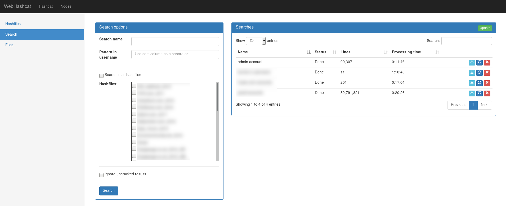

# WebHashcat
Hashcat web interface

WebHashcat is a very simple but efficient web interface for hashcat password cracking tool.
It hash the following features:
* Distributed cracking sessions between multiple server (you only need to install HashcatNode on the remote server)
* Cracked hashes are displayed almost as soon as they are cracked
* Cracking session restore (for example after host reboot)
* Upload plaintext files for analytics purposes
* Search patterns through the entire database
* Analytics

Currently WebHashcat supports rule-based and mask-based attack mode

This project is composed of 2 parts: 
- WebHashcat, the web interface made with the django framework 
- HashcatNode, A hashcat wrapper which creates an API over hashcat

## WebHashcat Usage

### Adding rules, masks and wordlists to webhashcat

Go to the Hashcat > Files page, than simply use the upload button to add new files. Note that uploaded files are added to webhashcat but not deployed to nodes yet.

<p align="center"></p>

### Registering a node

The nodes can be simply added and removed on the Node page, you only need to define the ip, port, username and password (as defined in the hashcatnode configuration script).

<p align="center"></p>

Once a node is registered, click on the node and hit the synchronise button on the top. Rules, Masks and Wordlists should now be uploaded to the node (all files should be green).

<p align="center"></p>

### Adding a hashfile

In the hashcat page, simply hit the bottom "add" button to upload a new hashfile, after comparing the new hashfile to the centralised potfile (can take a few minutes with huge hashfiles), your hashfile should appear in the list.

### Creating a cracking session

Simply hit the "+" button on the left of the hashfile, then select the desired cracking method. Note that sessions aren't started automatically, you will need to use the "play" button to start them.

<p align="center"></p>

If you set the cron to 5 minutes, the central potfile will be updated every 5 minutes with newly cracked hashes.

Simply click on the hashfile to view the results, it can take few seconds on huge hashfiles. Note that you can also download the results on both the hashfile list and hashfile views.

<p align="center"></p>

### Search for ŝpecific patterns in usernames

Using this functionality you can easily search from client's email addresses in leaks uploaded in webhashcat. Simply provide a string you want to look for in the username and select in which hashfiles you want to look for it. Once the research in the database is done, you should be able to download the results. If you add a new hashfile afterwards, you can simply click on the 'reload' button and WebHashcat will search again in the whole database.

<p align="center"></p>

## Install

### HashcatNode
HashcatNode can be run on both Windows and Python

Windows limitation:
Only **one** cracking session can be running/paused at a time

Install the pip packages:
```
pip3 install -r requirements.txt
```
If you are running it on Windows, install also the pywin32 package
```
pip3 install pywin32
```

Rename the `settings.ini.sample` file to `settings.ini` and fill the parameters accordingly.

The rules, mask and wordlist directory must be writable by the user running hashcatnode

the hashcatnode can be run simply by running `./hashcatnode.py`

* Create the database (sqlite)
Run the script (HashcatNode folder)
```
./create_database.py
```

* Create the node certificates (Install a Windows version of OpenSSL if you are running HashcatNode on Windows)
```
openssl req -x509 -newkey rsa:4096 -keyout server.key -out server.crt -days 365 -nodes
```

* HashcatNode can be started manually by:
```
python3 hashcatnode.py
```

* Register as a service (systemd) (linux only)
Edit the systemd/hashcatnode.service file to match your setup, then copy it to /etc/systemd/system/ 

#### Dependencies

- python3
- flask
- flask-basicauth
- peewee
- hashcat >= 3

### WebHashcat


#### Installing Packages

Install the following packages:
```
apt install mysql-server
apt install libmysqlclient-dev
apt install redis
apt install supervisor
```

Install the pip packages:
```
pip3 install -r requirements.txt
```

#### Creating the database

Create the database using the following command to ensure you can insert utf8 usernames/passwords
```
mysql> CREATE DATABASE webhashcat CHARACTER SET utf8;
mysql> CREATE USER webhashcat IDENTIFIED BY '<insert_password_here>';
mysql> GRANT ALL PRIVILEGES ON webhashcat.* TO 'webhashcat';
```

#### Configuration

WebHashcat is a django application using mysql database, its installation is done this way:
* Copy `Webhashcat/settings.py.sample` file to `WebHashcat/settings.py`
* Edit it:
- Change the SECRET_KEY parameter
You can generate a random secret key by running this in a python shell
```
from django.utils.crypto import get_random_string

chars = 'abcdefghijklmnopqrstuvwxyz0123456789!@#$%^&*(-_=+)'
get_random_string(50, chars)
```
- Add your webhashcat fqdn to ALLOWED_HOSTS
- Set your mysql username and password in the DATABASES section
- Set DEBUG = False if you are using it in production !
you can refer to the following django documentation for further info: https://docs.djangoproject.com/en/2.0/howto/deployment/checklist/

* Copy `settings.ini.sample` file to `settings.ini`
* Edit `settings.ini` file
- the potfile parameter doesn't need to be changed

* Create the tables with django
```
./manage.py makemigrations
./manage.py migrate
```

* Create the user to access the interface
```
./manage.py createsuperuser
```

#### Setting up the web server

* If you want to test the interface without setting up a web server use this command:
```
./manage.py runserver
```

* If you want to set up the interface with a proper webserver like apache or nginx please refer to the following documentation:
https://docs.djangoproject.com/en/2.0/howto/deployment/wsgi/modwsgi/

#### Setting up supervisor

Supervisor is the deamon which is responsible of heavy background tasks such as pulling latest results from the nodes or importing hashfiles.

* After installing supervisor, copy the configuration files from the Webhashcat/supervisor folder to the /etc/supervisor/conf.d/ folder.
* Once done, edit them to match your configuration

#### Dependencies

- python3
- django >= 2
- hashcat >= 3
- mysqlclient
- humanize
- requests
- requests-toolbelt
- celery
- redis
- supervisor

## Operating System improvements

If you are willing to process more than 10M hashes, I recommend you to apply the following mofication to your system:
* Increase the your /tmp size: Mysql tends to put a lot of data in the /tmp directory when processing huge hashfiles
* Increase your swap partition size
* If you use InnoDB tables in you MySQL configuration, I recommend you to edit your my.cnf configuration file and increase the innodb_buffer_pool_size value. This way MySQL will be able to allocate sufficiant memory when updating cracked hashes.
