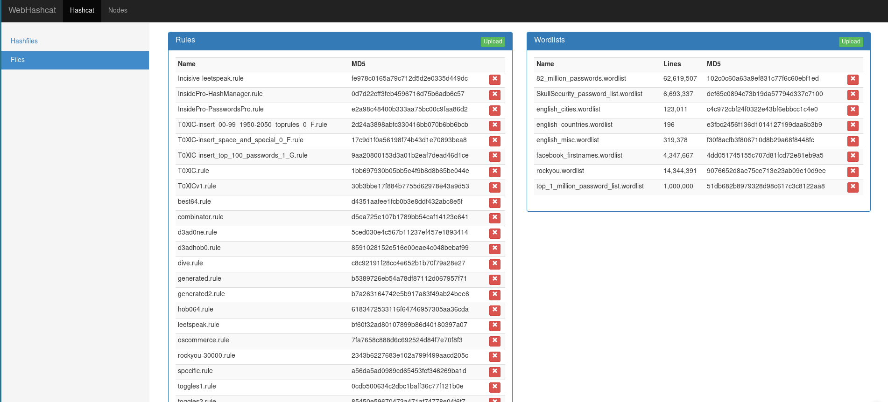
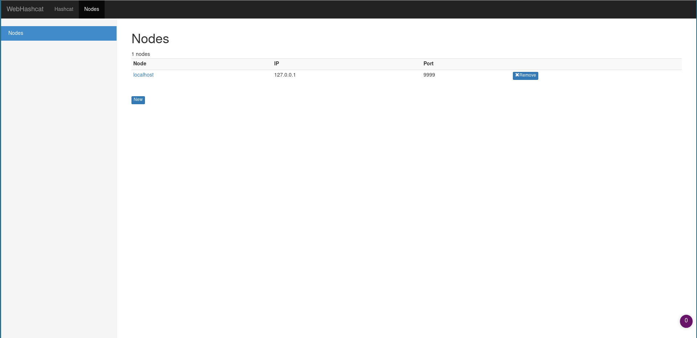
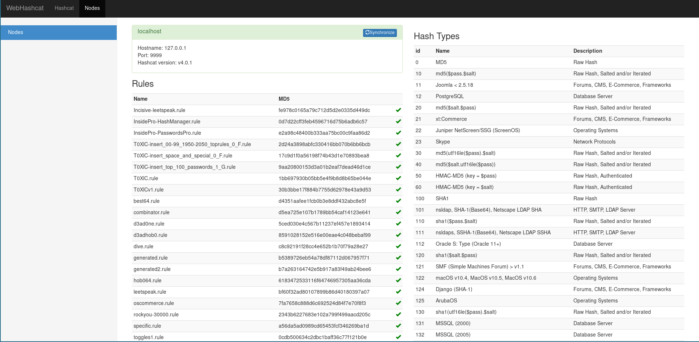
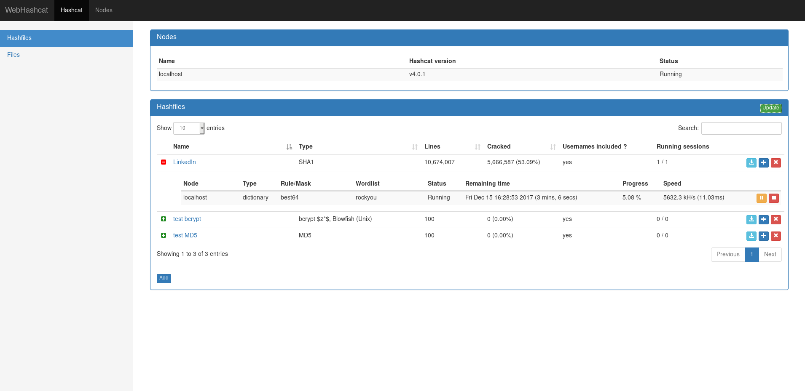
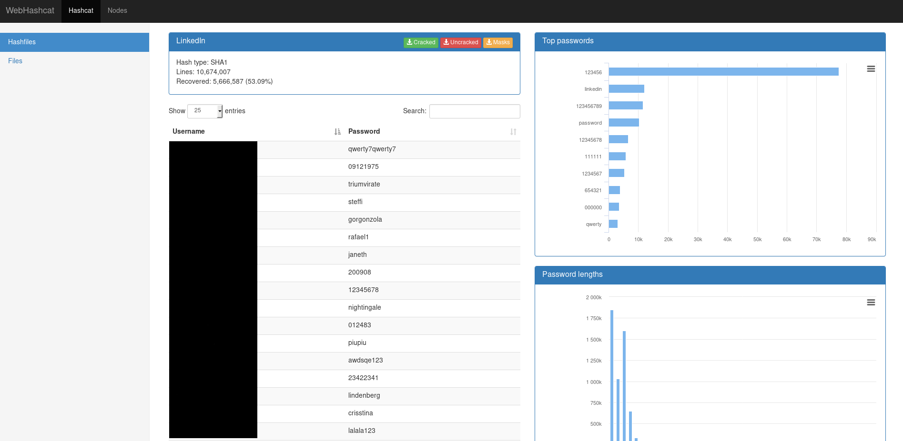

# WebHashcat
Hashcat web interface

WebHashcat is a very simple but efficient web interface for hashcat password cracking tool.
It hash the following features:
* Distributed cracking sessions between multiple server (you only need to install HashcatNode on the remote server)
* Cracked hashes are displayed almost as soon as they are cracked
* Analytics

Currently WebHashcat supports rule-based and mask-based attack mode

This project is composed of 2 parts: 
- WebHashcat, the web interface made with the django framework 
- HashcatNode, A hashcat wrapper which creates an API over hashcat

## WebHashcat Usage

### Adding rules, masks and wordlists to webhashcat

Go to the Hashcat > Files page, than simply use the upload button to add new files. Note that uploaded files are added to webhashcat but not deployed to nodes yet.

<p align="center"></p>

### Registering a node

The nodes can be simply added and removed on the Node page, you only need to define the ip, port, username and password (as defined in the hashcatnode configuration script).

<p align="center"></p>

Once a node is registered, click on the node and hit the synchronise button on the top. Rules, Masks and Wordlists should now be uploaded to the node (all files should be green).

<p align="center"></p>

### Adding a hashfile

In the hashcat page, simply hit the bottom "add" button to upload a new hashfile, after comparing the new hashfile to the centralised potfile (can take a few minutes with huge hashfiles), your hashfile should appear in the list.

### Creating a cracking session

Simply hit the "+" button on the left of the hashfile, then select the desired cracking method. Note that sessions aren't started automatically, you will need to use the "play" button to start them.

<p align="center"></p>

If you set the cron to 5 minutes, the central potfile will be updated every 5 minutes with newly cracked hashes.

Simply click on the hashfile to view the results, it can take few seconds on huge hashfiles. Note that you can also download the results on both the hashfile list and hashfile views.

<p align="center"></p>

## Install

### HashcatNode

Rename the settings.ini.sample file to settings.ini and fill the parameters accordingly.

The rules, mask and wordlist directory must be writable by the user running hashcatnode

the hashcatnode can be run simply by running `./hashcatnode.py`

* Create the database (sqlite)
Run the script (HashcatNode folder)
```
./create_database.py
```

* Create the node certificates
```
openssl req -x509 -newkey rsa:4096 -keyout server.key -out server.crt -days 365 -nodes
```

#### Dependencies

- python3
- flask
- flask-basicauth
- peewee
- hashcat >= 3

### WebHashcat

#### Configuration

WebHashcat is a django application using mysql database, its installation is done this way:
* Edit `WebHashcat/settings.py` file:
- Change the SECRET_KEY parameter
You can generate a random secret key by running this in a python shell
```
from django.utils.crypto import get_random_string

chars = 'abcdefghijklmnopqrstuvwxyz0123456789!@#$%^&*(-_=+)'
get_random_string(50, chars)
```
- Add your webhashcat fqdn to ALLOWED_HOSTS
- Set your mysql username and password in the DATABASES section
- Set DEBUG = False if you are using it in production !
you can refer to the following django documentation for further info: https://docs.djangoproject.com/en/2.0/howto/deployment/checklist/

* Edit `settings.ini` file
- the potfile parameter doesn't need to be changed

* Create the database with django
```
./manage.py makemigrations
./manage.py migrate
```

* Create the user to access the interface
```
./manage.py createsuperuser
```

#### Setting up the web server

* If you want to test the interface without setting up a web server use this command:
```
./manage.py runserver
```

* If you want to set up the interface with a proper webserver like apache or nginx please refer to the following documentation:
https://docs.djangoproject.com/en/2.0/howto/deployment/wsgi/modwsgi/

#### Setting up the automatic hashfile updates

* Register the following command in a crontab (in the following example the hashfiles will be updated every 5 minutes):
```
*/5 * * * *    /path/to/WebHashcat/cron.py <webhashcat_ip/host> <webhashcat_port> [--ssl]
```

#### Dependencies

- python3
- django >= 2
- hashcat >= 3
- mysqlclient
- humanize
- requests
- schedule
